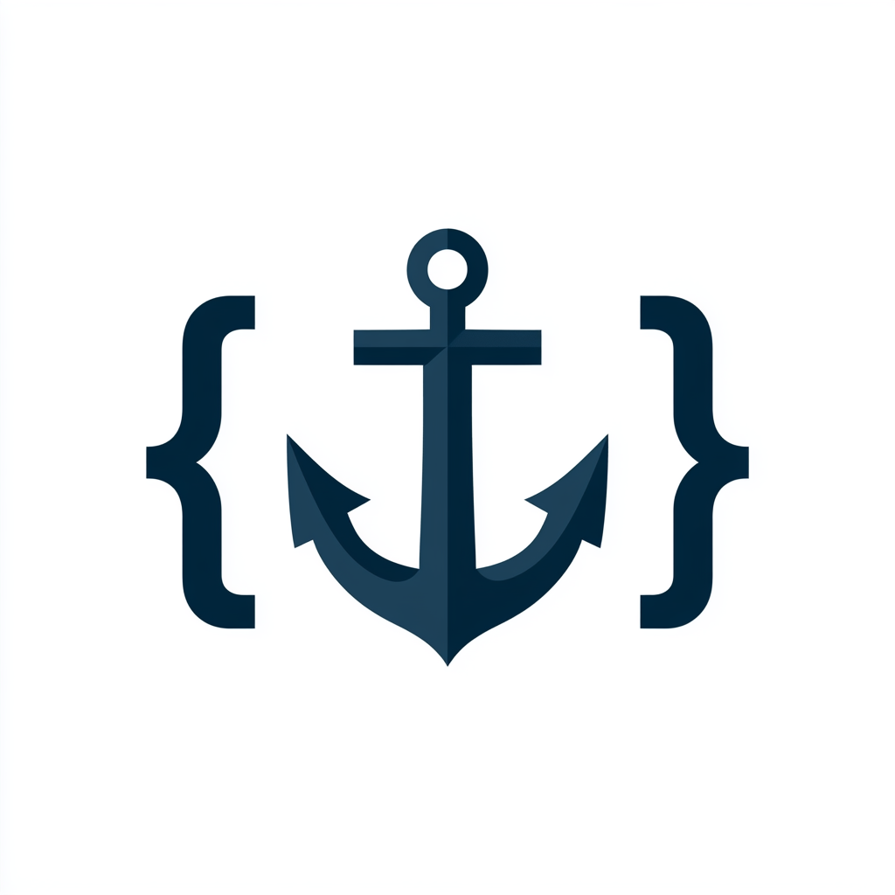

<div align="center">
  

  <h1>AnkerCode</h1>

  <p><strong>Ruhe vor dem Audit.</strong></p>

  <p>
    CRA &amp; BSI compliance evidence for German software teams.<br/>
    Scan. Enforce policy. Report. Zero data leaves your machine.
  </p>

  <p>
    
    
    
    
  </p>

  <p>
    <a href="https://docs.ankercode.io"><strong>📖 docs.ankercode.io</strong></a>
  </p>
</div>

---

## What it does

AnkerCode runs battle-tested open-source scanners on your repository, normalizes the results into a structured evidence model, and produces an **audit-ready German-language compliance report** — all without your source code ever leaving the machine.

```
ankercode scan          →  SBOM (CycloneDX) + findings.json
ankercode policy check  →  evaluate findings against your compliance rules
ankercode report        →  German PDF  /  HTML  /  DOCX  (policy result included)

ankercode check         →  all three in one command
```

Built for **German Mittelstand** software teams — Maschinenbau, IoT/Industrie 4.0, MedTech — who need to demonstrate CRA Readiness and BSI TR-03183 alignment without standing up a platform or hiring a dedicated security team.

---

## Why AnkerCode

| Without AnkerCode | With AnkerCode |
|---|---|
| Manual CVE tracking in spreadsheets | Automated scan with every release |
| No SBOM → blocked at customer audit | CycloneDX SBOM generated in seconds |
| Legal asks "what's in your product?" → panic | Evidence pack ready to hand over |
| Expensive consultant for every report | €0 per report after setup |
| Code sent to cloud scanners | Source stays on your machine, always |

> **CRA Article 14** reporting obligations apply from **11 September 2026**. You cannot file a credible 24h vulnerability report if you don't know what's in your product. AnkerCode builds that knowledge continuously.

---

## Quick Start

**Requirements:** Node.js ≥ 18, Git

```zsh
git clone https://github.com/ifya/AnkerCode.git
cd AnkerCode
./install.sh
```

The installer handles everything — Syft, Trivy, Gitleaks, Pandoc, wkhtmltopdf, and the CLI itself. Supports Linux and macOS.

**Then scan your project:**

```zsh
# 1. Create config files (decisions + policy rules)
ankercode init /path/to/your/project
# → edit ankercode.decisions.yaml  (VEX statements, accepted risks)
# → edit ankercode.policy.yaml     (which findings block CI, which warn)

# 2. Scan
ankercode scan /path/to/your/project --project my-product

# 3. Evaluate policy
ankercode policy check /path/to/your/project

# 4. Generate the report
ankercode report /path/to/your/project --pdf --html --docx
```

Or run everything in one command:

```zsh
ankercode check /path/to/your/project --project my-product
```

Open `ankercode/report-YYYY-MM-DD.pdf`. Done.

**Staying up to date:**

```zsh
ankercode upgrade               # pull latest AnkerCode + rebuild
ankercode upgrade --scanners    # also update Syft, Trivy, Gitleaks, Pandoc
```

---

## Report Sections

Every generated report contains:

| # | Section | Content |
|---|---|---|
| 1 | **Zusammenfassung** | KPIs — findings, critical/high open, secrets, policy status |
| 2 | **Policy-Bewertung** | *(present when policy file exists)* — pass/fail verdict, violation table |
| 3 | **SBOM-Zusammenfassung** | CycloneDX reference, SHA-256 hash, component count |
| 4 | **Schwachstellen** | All vulnerabilities grouped by severity |
| 5 | **Lizenz-Risiko** | All detected licenses grouped by SPDX identifier |
| 6 | **Vulnerability-Handling-Nachweis** | VEX statements — your signed decisions per CVE |
| 7 | **Akzeptierte Risiken** | Risk acceptances with author, reason, expiry |
| 8 | **Methodik & Scanner-Versionen** | Pinned scanner versions + policy file reference |

---

## CI Integration

AnkerCode ships a Docker image so CI pipelines need zero local setup — no Node, no Syft, no Trivy, no Gitleaks.

**GitHub Actions (copy-paste ready):**

```yaml
- name: AnkerCode Security Scan
  run: |
    docker run --rm \
      -v ${{ github.workspace }}:/scan \
      -e ANKERCODE_API_KEY=${{ secrets.ANKERCODE_API_KEY }} \
      ghcr.io/ifya/ankercode:latest \
      scan /scan \
        --project "${{ github.event.repository.name }}" \
        --output-dir /scan/.ankercode \
        --fail-on high \
        --quiet

- uses: actions/upload-artifact@v4
  if: always()
  with:
    name: ankercode-${{ github.sha }}
    path: .ankercode/
    retention-days: 90
```

A full workflow with Maven cache, HTML report generation, and optional dashboard upload is at [`.github/workflows/ankercode.yml`](.github/workflows/ankercode.yml).

**Scan flags for CI:**

| Flag | Default | Purpose |
|---|---|---|
| `--fail-on critical\|high\|medium\|low\|any` | off | Quick threshold gate — exit 2 on severity match |
| `--quiet` | off | Suppress human output; emit JSON summary to stdout |
| `--output-dir <dir>` | `<path>/ankercode/` | Write findings + SBOM to a specific directory |

> For production pipelines, replace `--fail-on` with an `ankercode.policy.yaml` — it gives you per-scope rules, license blocking, secret enforcement, and a Policy-Bewertung section in the report. See [Policy Engine](#policy-engine).

**Exit codes:**

| Code | Meaning |
|---|---|
| `0` | Clean — no findings at/above threshold |
| `1` | Runtime error (bad path, scanner crashed) |
| `2` | Policy gate — findings found at/above `--fail-on` threshold |

**Docker image:** `ghcr.io/ifya/ankercode:latest` — `linux/amd64` + `linux/arm64`, ~450 MB.

> **Maven projects:** mount your `~/.m2` cache to avoid Trivy hitting Maven Central rate limits:
> `docker run -v ~/.m2:/root/.m2 ...`

---

## Air-Gap / Offline Use

AnkerCode's Docker image is lean (~450 MB) and downloads the Trivy vulnerability database on first use. For air-gapped or firewall-restricted environments, pre-seed the database once in a connected environment and carry it across.

**Step 1 — seed the Trivy database (connected machine)**

```bash
mkdir -p ~/.cache/trivy

# Vulnerability database (~55 MB)
docker run --rm \
  -v ~/.cache/trivy:/root/.cache/trivy \
  ghcr.io/ifya/ankercode:latest \
  trivy fs --download-db-only /tmp

# Java artifact index (~150 MB) — needed for Java/Maven projects
docker run --rm \
  -v ~/.cache/trivy:/root/.cache/trivy \
  ghcr.io/ifya/ankercode:latest \
  trivy fs --download-java-db-only /tmp
```

**Step 2 — transfer the cache to the air-gapped machine**

Copy `~/.cache/trivy/` to the target machine (USB, internal artifact store, etc.).

**Step 3 — run offline**

```bash
docker run --rm \
  -v /path/to/repo:/scan \
  -v ~/.cache/trivy:/root/.cache/trivy \
  -e TRIVY_SKIP_DB_UPDATE=true \
  -e TRIVY_SKIP_JAVA_DB_UPDATE=true \
  ghcr.io/ifya/ankercode:latest \
  scan /scan --project myproduct
```

The two environment variables tell Trivy to use the mounted cache as-is and make zero outbound calls. The Trivy DB is roughly 200 MB total; refresh it whenever your security team wants a newer advisory snapshot.

> **Java/Maven projects in air-gap:** Trivy also downloads parent POM files from Maven Central to resolve the transitive dependency tree. Pre-warm `~/.m2` on a connected machine with `mvn dependency:resolve`, then mount it: `-v ~/.m2:/root/.m2`.

---

## Under the Hood

AnkerCode wraps — never reimplements — the best open-source scanners:

| Scanner | Purpose | Output |
|---|---|---|
| [Syft](https://github.com/anchore/syft) | SBOM generation | CycloneDX JSON |
| [Trivy](https://github.com/aquasecurity/trivy) | CVE detection + license scanning | Findings |
| [Gitleaks](https://github.com/gitleaks/gitleaks) | Secret detection | Findings |
| [Pandoc](https://pandoc.org) + wkhtmltopdf | Report rendering | PDF / HTML / DOCX |

The normalized **evidence data model** (`@ankercode/core`) is the durable asset — open formats throughout: [CycloneDX](https://cyclonedx.org), [OpenVEX](https://openvex.dev), [SARIF](https://sarifweb.azurewebsites.net).

---

## Decisions & Triage

AnkerCode separates *scanning* from *human judgment*. After a scan, create a `ankercode.decisions.yaml` at your project root:

```yaml
vex:
  - findingId: "8517dab0c1fdf5b1"
    status: not_affected
    justification: vulnerable_code_not_in_execute_path
    statement: "This package only runs on macOS build agents, never in production."
    author: "Jane Doe"
    timestamp: "2026-06-30T12:00:00Z"

riskAcceptances:
  - findingId: "f66b579fb1bcc03a"
    reason: "Build-time only dependency, not present in production runtime."
    acceptedBy: "Jane Doe"
    expiresAt: "2026-12-31"
```

Commit this file. It makes every report **reproducible** from source — same repo + same scanner versions + same decisions = identical evidence pack.

---

## Policy Engine

The policy engine enforces your compliance rules automatically — no manual review of every finding on every CI run.

**`ankercode init`** writes `ankercode.policy.yaml` alongside `ankercode.decisions.yaml`. Edit it to match your requirements:

```yaml
version: 1

vulnerabilities:
  # Rules evaluated top-to-bottom. First match wins.
  - id: block-critical-production
    severity: [critical]
    scope: [production]
    action: block          # exit 2 — blocks CI

  - id: block-high-production
    severity: [high]
    scope: [production]
    action: block

  - id: warn-medium-production
    severity: [medium]
    scope: [production]
    action: warn           # exit 0 — appears in report, does not block

  - id: warn-critical-dev
    severity: [critical, high]
    scope: [development, unknown]
    action: warn           # dev deps warn only

licenses:
  deny:
    - GPL-2.0-only         # block — incompatible with commercial use
    - GPL-3.0-only
    - AGPL-3.0-only
  warn:
    - LGPL-2.1-only
    - MPL-2.0
  scope: production        # only check production dependencies

secrets:
  action: block            # always block — non-negotiable
```

**Running the policy check:**

```zsh
ankercode policy check /path/to/project           # human-readable output
ankercode policy check /path/to/project --quiet   # JSON output for CI scripts
ankercode policy check /path/to/project --fail-on-warn  # also exit 2 on warnings
```

**How it interacts with your decisions:** findings marked `not_affected` or `fixed` in `ankercode.decisions.yaml`, and any risk-accepted findings, are automatically excluded from policy evaluation. You decide; the policy enforces.

**In the report:** when `policy-result.json` exists in the output directory, `ankercode report` automatically adds a **Policy-Bewertung** section showing the verdict, the full violation table (rule ID → finding → action), and the policy file reference.

**Exit codes** (same as `ankercode scan`):

| Code | Meaning |
|---|---|
| `0` | Policy passed — no violations |
| `1` | Runtime error |
| `2` | Policy violated — one or more `block` rules triggered |

---

## Monorepo Structure

```
ankercode/
  packages/
    core/     @ankercode/core   — evidence data model (Zod schemas, types, hashing, policy)
    cli/      @ankercode/cli    — ankercode scan | policy check | report | init | check
    report/   @ankercode/report — German template engine + Pandoc rendering
  assets/                       — logo and static assets
```

---

## Local-First Guarantees

- **Source code never leaves your machine.** Only normalized findings metadata, SBOMs, and hashes are involved — and only locally.
- **No telemetry.** No analytics, no phone-home, no beacons.
- **Deterministic evidence.** Pinned scanner versions ensure the same inputs always produce the same outputs.
- **Air-gap ready.** `ankercode scan` and `ankercode report` make no outbound network calls. The only external traffic is Trivy downloading its vulnerability database on first run (read-only, from aquasecurity servers) and Trivy resolving Maven POM files from Maven Central for Java projects — this is Trivy's own resolver, not AnkerCode. Pre-warm `~/.m2` with `mvn dependency:resolve` to avoid this entirely.
- **Upload is opt-in.** `ankercode upload` only runs when explicitly called with an API key.

---

## Regulatory Context

AnkerCode produces *technical inputs* to compliance processes. It does not certify or assert CRA conformity — a qualified human reviews and signs the evidence.

| Regulation | Relevance |
|---|---|
| CRA (EU) 2024/2847 | In force 10 Dec 2024. Full applicability 11 Dec 2027. |
| CRA Article 14 | Incident reporting obligations from **11 Sep 2026** |
| BSI TR-03183 | SBOM requirements — CycloneDX and SPDX referenced |

---

## Roadmap

- [x] Phase 0 — CLI + scanner adapters + German PDF report
- [x] Phase 0 — Docker image + CI integration (--fail-on, --quiet, --output-dir, GitHub Actions workflow)
- [x] Phase 2 — Policy engine (ankercode.policy.yaml, ankercode policy check, Policy-Bewertung in report)
- [ ] Phase 1 — History dashboard (Next.js + Supabase) + VS Code extension
- [ ] Phase 2 — Policy: dashboard integration (policy status per scan run) + audit trail
- [ ] Phase 2 — On-prem Docker Compose package

---

## License

AGPL-3.0-only © [Ifya](https://github.com/ifya)

Free to use, study, and modify. If you run AnkerCode as a network service (SaaS, hosted tool, API), you must release your modifications under the same license. Commercial use without open sourcing requires a separate agreement.

---

<div align="center">
  <sub>Built for teams who need <em>Ruhe vor dem Audit</em>.</sub>
</div>
